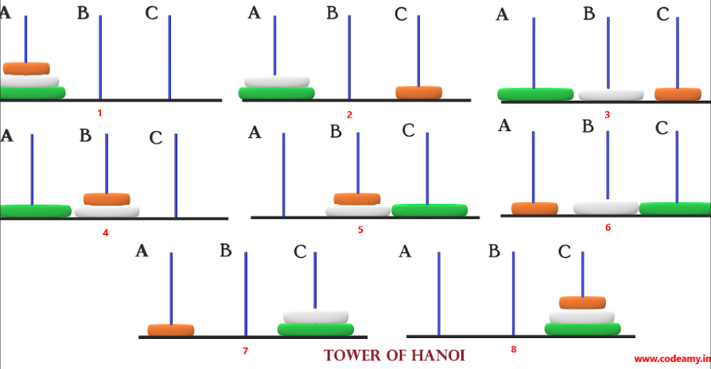
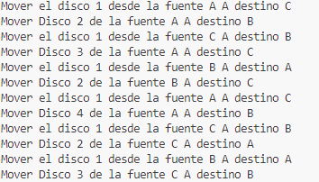

# 🏰 Torres de Hanoi - Implementación en Python 🏰 

## :newspaper: Descripción :newspaper:

Este proyecto implementa una solución algorítmica al clásico problema de las Torres de Hanoi utilizando Python. La solución demuestra la eficacia de la programación recursiva para resolver problemas de complejidad exponencial.

## :japanese_castle: Especificaciones Técnicas :japanese_castle:

- **Lenguaje**: Python 3.x
- **Paradigma**: Programación recursiva

## :mahjong: Algoritmo :mahjong:

La implementación se basa en el siguiente algoritmo recursivo:

1. Mover n-1 discos de la torre origen a la torre auxiliar
2. Mover el disco n de la torre origen a la torre destino
3. Mover n-1 discos de la torre auxiliar a la torre destino

## :mount_fuji: Análisis de Complejidad :mount_fuji:
 
- **Tiempo**: T(n) = 2T(n-1) + 1, que se resuelve a T(n) = O(2^n)
- **Espacio**: S(n) = O(n) debido a la profundidad máxima de la pila de recursión

## 🚀 Optimizaciones Potenciales 🚀

1. **Implementación iterativa**: Reduce el uso de la pila de llamadas
2. **Memorización**: Para problemas que involucren cálculos repetitivos
3. **Paralelización**: Para mover discos independientes simultáneamente en sistemas multi-core

## :detective: Rendimiento :detective:

| Número de Discos | Movimientos Requeridos |
|-------------------|------------------------|
| 3                 | 7                      |
| 4                 | 15                     |
| 5                 | 31                     |
| n                 | 2^n - 1                |

## :kimono: Pruebas Unitarias :kimono:

Se recomienda implementar pruebas unitarias utilizando el módulo `unittest` de Python para verificar:

1. Casos base (n = 1, n = 2)
2. Casos generales (n > 2)
3. Manejo de errores (n < 1)

## :camera: Capturas de pantalla :camera:

## :confetti_ball: Documentación :confetti_ball:

:computer: Para obtener información más detallada sobre cómo usar esta aplicación, por favor consulta nuestra guía de usuario completa en PDF :computer:

<a href="img/Hannoi.pdf" class="button" style="display: inline-block; padding: 10px 20px; background-color: #3498db; color: white; text-decoration: none; border-radius: 5px; transition: background-color 0.3s;"> :wink: Descargar Guía de Usuario (PDF) :wink: </a>

Link del proyecto: :octocat: [https://github.com/T0NY24/Hanooi.git](https://github.com/T0NY24/Hanooi.git):octocat:

¡Las contribuciones son bienvenidas! :hearts: Si tienes una sugerencia para mejorar esto, por favor bifurca el repositorio. ¡No olvides darle una estrella al proyecto! :trophy: :trophy:

<a href="https://github.com/T0NY24/Hanooi.git" class="button" style="display: inline-block; padding: 10px 20px; background-color: #3498db; color: white; text-decoration: none; border-radius: 5px; transition: background-color 0.3s;">:octocat: Ver en GitHub :octocat: </a>
